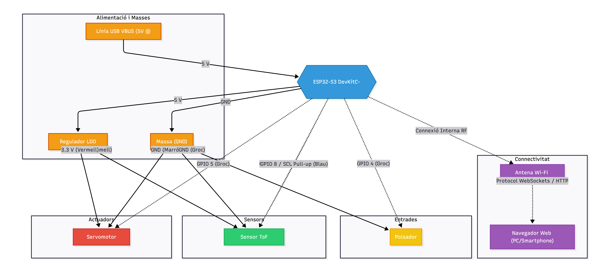

<div style="margin-top: 250px;">

<h1 style="text-align: center; border-bottom: 1px solid black; padding-bottom: 15px; font-weight: bold;">Radar ESP32 amb sensor ultrasons (I2C)</h1>
<h3 style="text-align: center; font-weight: bold;">Processadors digitals</h3>

</div>

<div style="margin-top: 550px;">

**Estudiant:** Lluc Castella i Charlotte Garciano <br>
**Grup:** Grup 12 <br>
**Data:** 26 de Maig de 2026

</div>

<div style="page-break-after: always;"></div>

### **1. FUNCIONALITAT**

<div align="justify">

- **Escombrat angular automatitzat:** El sistema controla un servomotor per realitzar un moviment continu de vaivé en un rang de 0° a 180° (o un subrang configurable), aturant-se subtilment en passos discrets (per exemple, d'1° o 2°) per prendre lectures.
- **Cerca del Zero Mecànic (Homing):** En prémer el botó físic de calibratge, el sistema executa una rutina d'interrupció instantània que atura l'escombrat actual i posiciona el servomotor exactament a la posició de referència (0°), reiniciant el recompte de passes per corregir possibles pèrdues de posició.
- **Mesura per Temps de Vol (ToF):** En cada pas angular, el microcontrolador realitza una mesura de distància precisa utilitzant un sensor làser ToF mitjançant el bus I2C, evitant els problemes de dispersió i falsos ecos dels sensors d'ultrasons tradicionals.
- **Processament i mapatge de coordenades:** L'ESP32-S3 calcula la posició espacial de l'objecte detectat convertint les coordenades polars (distància i angle) a coordenades cartesianes $(X, Y)$ en temps real.
- **Interfície visual interactiva (Radar Scope):** La pàgina web renderitza un gràfic de radar dinàmic que mostra els punts detectats, un vector d'escombrat i un rastre de persistència de decaïment per simular una pantalla de radar militar.
- **Sensors i actuadors:**
  - Sensor: Sensor de distància per Temps de Vol (ToF) VL53L1X (abast de fins a 4 metres).
  - Actuadors/Inputs: Servomotor de precisió MG90S i un Pulsador físic de panell amb resistència de pull-up interna.
- **Protocols de comunicació:**
  - Wi-Fi (802.11 b/g/n): Configurable en mode Access Point (AP) per a connexió directa local, o Station (STA) per integrar-se a la xarxa de la universitat.
  - HTTP: Per a la càrrega inicial de l'aplicació web.
  - WebSockets: Per a l'streaming bidireccional i continu de dades de telemetria.
  - I2C: Per a la comunicació síncrona entre l'ESP32-S3 i el sensor ToF.
- **Modes de funcionament:**
  - Mode Escombrat (Normal): Funcionament ordinari de mesura i moviment.
  - Mode Calibració (Homing): Activitat prioritària de retorn al punt d'origen en prémer el botó.
  - Mode Espera (Standby): Atura el moviment del motor si no hi ha cap usuari connectat a la pàgina web per estalviar energia i desgast mecànic.
</div>
<br>

<div style="page-break-after: always;"></div>

### **2. DIAGRAMA DE BLOCS**

#### **Diagrama de blocs**



#### **Codi mermaid**

>  ```
> ---
> config:
>   layout: fixed
> ---
> flowchart TB
>  subgraph Alimentacio["Alimentació i Masses"]
>         USB["Línia USB VBUS (5V @ 2A)"]
>         REG["Regulador LDO 3.3V"]
>         GND["Massa (GND)"]
>   end
>  subgraph Entrades["Entrades"]
>         BOTO["Polsador"]
>   end
>  subgraph Sensors["Sensors"]
>         TOF["Sensor ToF VL53L1X"]
>   end
>  subgraph Actuadors["Actuadors"]
>         SERVO["Servomotor MG90S"]
>   end
>  subgraph Connectivitat["Connectivitat"]
>         WIFI["Antena Wi-Fi Integrada"]
>         WEB["Navegador Web (PC/Smartphone)"]
>   end
>     USB -- 5 V --> ESP32{{"ESP32-S3 DevKitC-1"}}
>     ESP32 -- 5 V --> REG
>     REG -- "3.3 V (Vermell)" --> TOF & SERVO
>     ESP32 -- GND --> GND
>     GND -- GND (Negre) --> TOF
>     GND -- GND (Marró) --> SERVO
>     GND -- GND (Groc) --> BOTO
>     ESP32 -. GPIO 5 (Groc) .-> SERVO
>     ESP32 -. "GPIO 9 / SDA Pull-up (Verd)" .-> TOF
>     ESP32 -. "GPIO 8 / SCL Pull-up (Blau)" .-> TOF
>     ESP32 -. GPIO 4 (Groc) .-> BOTO
>     ESP32 -. Connexió Interna RF .-> WIFI
>     WIFI -. Protocol WebSockets / HTTP .-> WEB
> 
>      USB:::power
>      REG:::power
>      GND:::power
>      BOTO:::input
>      TOF:::sensor
>      SERVO:::actuator
>      WIFI:::net
>      WEB:::net
>      ESP32:::mcu
>     classDef mcu fill:#3498db,stroke:#2980b9,stroke-width:2px,color:#fff
>     classDef sensor fill:#2ecc71,stroke:#27ae60,stroke-width:2px,> color:#fff
>     classDef power fill:#f39c12,stroke:#d35400,stroke-width:2px,> color:#fff
>     classDef actuator fill:#e74c3c,stroke:#c0392b,stroke-width:2px,> color:#fff
>     classDef net fill:#9b59b6,stroke:#8e44ad,stroke-width:2px,color:#fff
>     classDef input fill:#f1c40f,stroke:#f39c12,stroke-width:2px,> color:#fff
> ```

### **3. COSTS**

Pel nostre projecte, el cost que hem gastat es el següent:

> 
> | Component | Referencica | Preu Unitari (€) | Quantitat | Subtotal (€) |
> | :--: | :---: | :---: | :---: | :---: |
> | Placa de desenvolupament ESP32-S3 | ESP32-S3-DevKitC-1 | 7,00 | 1 | 7,00 |
> | Placa de desenvolupament, adaptador | ESP32-S3 Expansion Board | 2,50 | 1 | 2,50 |
> | Cables de connexió | Pack de 40 cables tipus Jumper | 1,80 | 1 | 1,80 |
> | Cable de connexió PC | Cable USB-C de dades robust | 2,00 | 1 | 2,00 |
> | Interruptor | Polsador de panell negre | 0,10 | 1 | 0,10 |
> | Sensor I2C | RCWL-1601 | 4,10 | 1 | 4,10 |
> | Mini Servomotor | SG90 | 3,40 | 1 | 3,40 |
>

_Els preus unitaris estan basats en AliExpress_

**Preu total ||** 20,90 €
